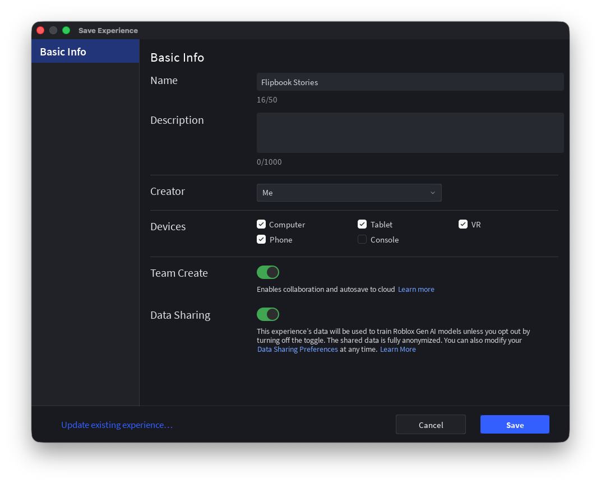
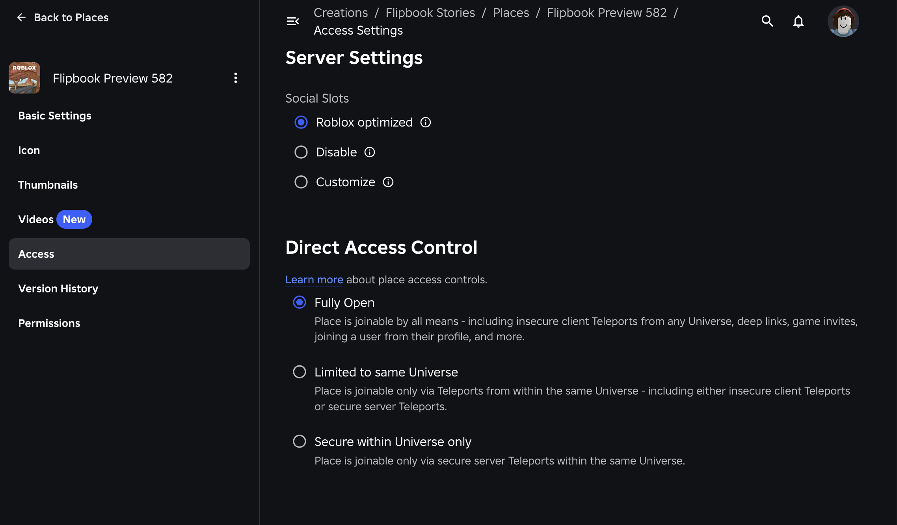
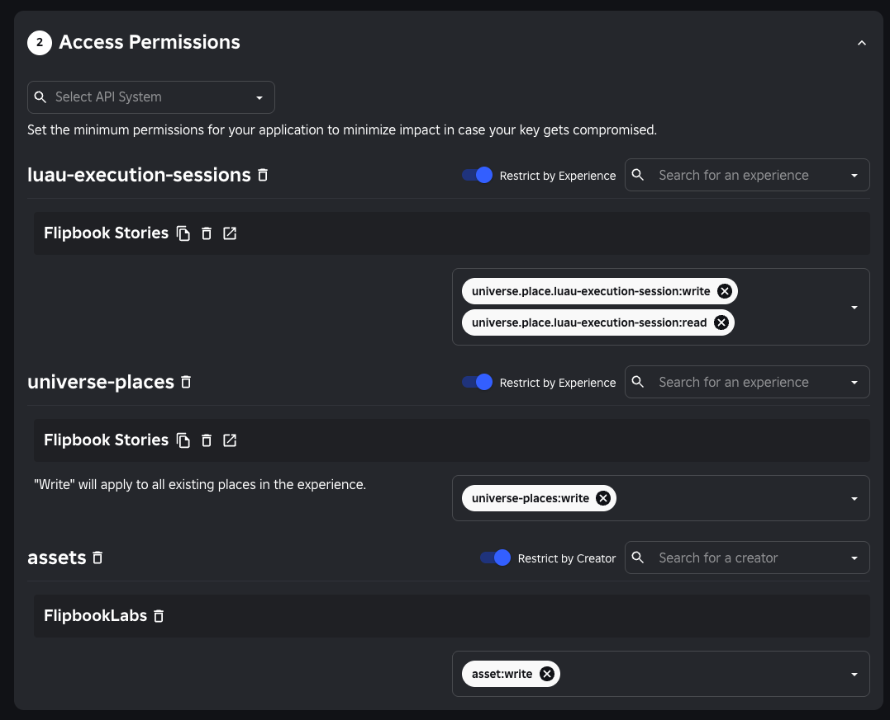

# deploy-storybook

A GitHub Action that deploys a [Flipbook](https://github.com/flipbook-labs/flipbook)
storybook to a Roblox experience via Open Cloud.

Plug in an API key, a universe ID, and a pre-built `.rbxl` — the action handles
the rest. Uses `ubuntu-latest` or `macos-latest` runners.

## Setup

### 1. Create the storybook preview experience

1. Navigate to the [Creator Hub](https://create.roblox.com/dashboard/creations) and create a new experience.
2. Give it a name and publish it.

   

3. Copy the **UniverseId** and **PlaceId** — you'll need them later.
4. Close out of the experience in Studio to avoid "Conflict" errors during deploys.
5. Navigate to the start place and enable **Direct Access Control > Fully Open**. This is what enables stable, PR-scoped URLs for each deployment.

   

### 2. Create an Open Cloud API key

1. Go to [https://create.roblox.com/dashboard/credentials](https://create.roblox.com/dashboard/credentials).
2. Click **Create API Key** and give it a name tied to the experience.
3. Optionally restrict it to that specific experience to reduce blast radius.
4. Grant it place-publishing access.

   
5. Generate the key and store it somewhere safe.

### 3. Add secrets to your GitHub repository

In your repository's **Settings > Environments** (or **Secrets and variables > Actions**):

| Name | Type | Value |
| ---- | ---- | ----- |
| `ROBLOX_API_KEY` | Secret | The Open Cloud API key from step 2 |
| `ROBLOX_STORYBOOK_UNIVERSE_ID` | Variable | The UniverseId from step 1 |

### 4. Add the workflow

See [Usage](#usage) below.

## Usage

Build your storybook `.rbxl` earlier in the job (e.g. with Rojo) and pass its
path as `place-file`.

```yaml
name: Deploy storybook
on:
  push:
    branches: [main]

jobs:
  deploy:
    runs-on: ubuntu-latest
    environment: production
    steps:
      - uses: actions/checkout@v4

      - name: Build storybook
        run: rojo build storybook.project.json -o storybook.rbxl

      - uses: flipbook-labs/deploy-storybook@v1
        with:
          api-key: ${{ secrets.ROBLOX_API_KEY }}
          universe-id: ${{ vars.ROBLOX_STORYBOOK_UNIVERSE_ID }}
          place-name: Flipbook Stories
          place-file: storybook.rbxl
```

### Per-PR preview deploys

Deploy each pull request to its own named place by setting `place-name`:

```yaml
- uses: flipbook-labs/deploy-storybook@v1
  with:
    api-key: ${{ secrets.ROBLOX_API_KEY }}
    universe-id: ${{ vars.ROBLOX_STORYBOOK_UNIVERSE_ID }}
    place-name: "PR ${{ github.event.pull_request.number }}"
    place-file: storybook.rbxl
```

If you keep multiple places with the same name, pass an explicit `place-id` to
disambiguate which one to publish to.

## Inputs

| Input           | Required | Description                                                                                           | Default               |
| --------------- | -------- | ----------------------------------------------------------------------------------------------------- | --------------------- |
| `api-key`       | yes      | Roblox Open Cloud API key. Pass from a secret.                                                        |                       |
| `universe-id`   | yes      | Universe (experience) ID to deploy to.                                                                |                       |
| `place-name`    | yes      | Name of the place to update or create, e.g. `Flipbook Stories` or `Storybook Preview`.               |                       |
| `place-file`    | yes      | Path to the built `.rbxl` place file containing your storybooks and stories.                         |                       |
| `place-id`      | no       | Explicit place ID to publish to; disambiguates same-named places.                                    |                       |
| `flipbook-rbxm` | no       | Path to a local `Flipbook.rbxm` runtime; skips downloading Flipbook from GitHub.                     |                       |
| `cli-version`   | no       | `flipbook-cli` version to install (no leading `v`).                                                   | `0.5.0`               |
| `rokit-version` | no       | Rokit version to install.                                                                             | `v1.2.0`              |
| `github-token`  | no       | Token used to authenticate downloads from GitHub Releases.                                            | `${{ github.token }}` |

## Required secrets and variables

We recommend creating a [GitHub Environment](https://docs.github.com/en/actions/deployment/targeting-different-deployment-environments/using-environments-for-deployment)
(e.g. `production`) and storing these there:

| Name                           | Type     | Description              |
| ------------------------------ | -------- | ------------------------ |
| `ROBLOX_API_KEY`               | Secret   | Open Cloud API key       |
| `ROBLOX_STORYBOOK_UNIVERSE_ID` | Variable | Universe (experience) ID |

See [Setup](#setup) for step-by-step instructions.

## Releasing

This action's own releases are automated with
[flipbook-cli](https://github.com/flipbook-labs/flipbook-cli)'s release
lifecycle, consumed as a Rokit tool (see [`rokit.toml`](rokit.toml)). The version
in [`loom.config.luau`](loom.config.luau) is the source of truth.

There are two workflows:

- **[`release-readiness.yml`](.github/workflows/release-readiness.yml)** runs on
  every push to `main`. It runs `flipbook-cli release gate` to decide whether to
  publish, and:
  - If the current version is untagged (a publish PR was merged), it tags the
    commit and opens a **draft** GitHub release (`release draft`).
  - It opens an `[AUTO-GENERATED] Publish vX.Y.Z` PR (`release prepare-pr` +
    [`peter-evans/create-pull-request`](https://github.com/peter-evans/create-pull-request))
    that bumps the version and regenerates `CHANGELOG.md` (via
    [git-cliff](https://github.com/orhun/git-cliff), configured in
    [`cliff.toml`](cliff.toml)).

  Merging that publish PR releases the version and prepares the next one.

- **[`release.yml`](.github/workflows/release.yml)** runs when a drafted release
  is **published**. Since a GitHub Action is consumed from a git ref, "deploying"
  means moving the major-version pointer tag: it force-updates `vMAJOR` (e.g.
  `v1`) to the released commit so consumers pinning
  `uses: flipbook-labs/deploy-storybook@v1` get the latest `v1.x.y`.

### Day-to-day

1. Merge feature PRs into `main`. Each push refreshes the open
   `[AUTO-GENERATED] Publish vX.Y.Z` PR.
2. When ready to ship, merge that publish PR. The next push to `main` drafts the
   GitHub release for the new tag.
3. Review the draft release and click **Publish**. `release.yml` then advances
   the `vMAJOR` pointer tag.

> [!NOTE]
> Requires the `FLIPBOOK_BACKEND_APP_ID` and `FLIPBOOK_BACKEND_APP_PRIVATE_KEY`
> org secrets (inherited from `flipbook-labs`; no per-repo setup needed).
